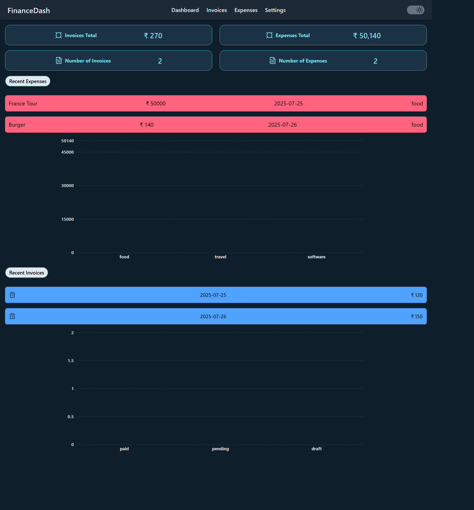

# Expense Tracker

A minimalist dashboard to manage your expenses and invoices — styled for clarity, built for control.
Lightweight. Theme-aware. Visually expressive.

## 🧩 Features

-   Add / Edit / Remove expenses & invoices
-   Month-based filtering logic
-   Paid / Pending / Draft invoice categorization
-   Dashboard with recent data + graphs
-   Currency switcher: ₹ / $ / €
-   Light & dark mode toggle

## 🛠️ TechStack

-   React + TypeScript
-   Tailwind CSS
-   Redux Toolkit
-   Custom hooks
-   Lucide-React icons
-   Recharts

## Pre-requisites:

-   [Node.js](https://nodejs.org) (latest stable version)
-   [Git](https://git-scm.com/downloads)
-   [VS code](https://code.visualstudio.com/download) or your favorite editor

## 📦 Setup

-   git clone https://github.com/SivaKrishna6745/ExpenseTracker.git
-   cd ExpenseTracker
-   npm install
-   npm run dev
-   Open your browser and visit:
    http://localhost:5173

## HomePage

